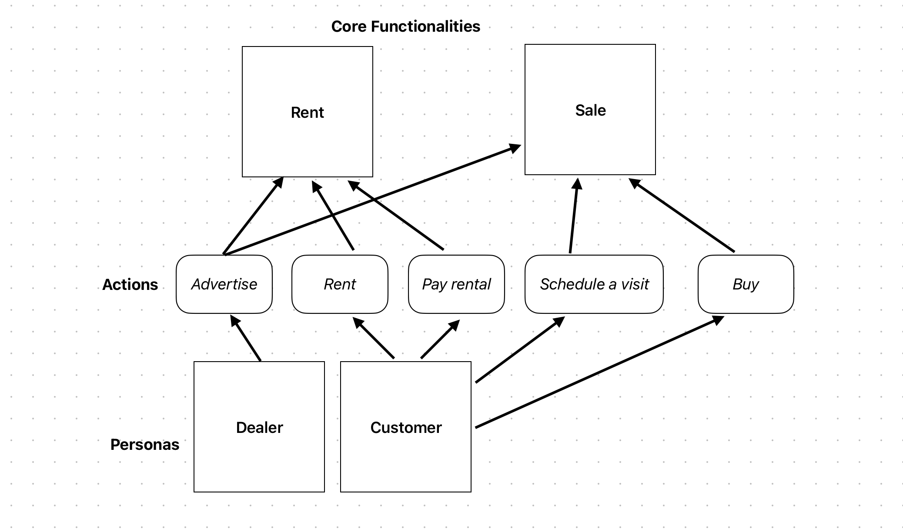
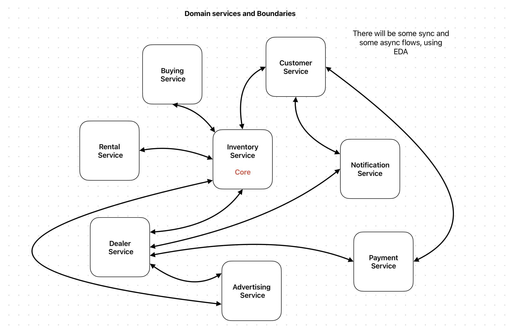

# 0002. Domain-Driven Design and Service Boundaries

Date: 2026-01-28

## Status

Approved

## Context

Following the decision to adopt microservices architecture (ADR 0001), we need to establish clear service boundaries aligned with business domains rather than technical layers. The Poise platform has distinct business capabilities that vary in complexity, data requirements, and scaling patterns.

The first step is to map the business around its primary personas and user-facing actions instead of around infrastructure concerns. The platform currently revolves around two personas:

- **Dealer**, who advertises vehicles and manages inventory
- **Customer**, who rents vehicles, buys vehicles, and schedules visits

Those personas drive the core functional areas shown below:

- **Rent**
- **Sale**

The action map also shows that some capabilities are shared across those functional areas. For example, vehicle inventory supports both rental and purchase flows, and advertising is a dealer-facing capability that feeds the broader sales experience.

If service boundaries are defined only by technical concerns such as "API", "database", or "media processing", the business language will become fragmented across teams and services. That would make ownership, scaling, and change management harder over time. We need boundaries that preserve business cohesion, define clear ownership, and still allow a mix of synchronous and asynchronous communication.

**Identify core functionalities, personas, and actions performed by them.**

## Decision

After having the core functionalities, personas and actions identified, we will adopt **Domain-Driven Design** principles to define service boundaries and establish the following **Bounded Contexts**:

We will organize the Poise platform into business-aligned bounded contexts, with the **Inventory Service** as the core domain context and surrounding services handling dealer management, customer management, transactions, advertising, payments, and notifications.

### Boundary rules

- **Business ownership first:** Each service owns a distinct business capability, vocabulary, and set of invariants.
- **Data ownership per bounded context:** Each service is the source of truth for its own data and exposes integrations through APIs or events instead of shared persistence.
- **Inventory as the operational core:** Vehicle state, availability, and core listing identity are centered in the Inventory Service because both rental and sales flows depend on them.
- **Mixed interaction model:** We will use synchronous calls for operations that require an immediate answer and asynchronous event-driven communication for state propagation, side effects, and long-running workflows.
- **Loose coupling through events:** Downstream reactions such as notifications, projection updates, and workflow continuation should prefer explicit domain events over direct orchestration when immediate consistency is not required.

### Services and responsibilities

- **Inventory Service (Core):** Owns the canonical representation of vehicles, listing identity, availability, and inventory lifecycle. It is the central business context used by rental, buying, dealer, and advertising capabilities.
- **Dealer Service:** Owns dealer profile, dealership management, and dealer-facing workflows related to managing inventory and initiating advertisements.
- **Customer Service:** Owns customer profile, customer preferences, and customer-facing identity needed by renting, buying, notifications, and payment-related interactions.
- **Advertising Service (AI pipeline):** Processes dealer-provided media, extracts vehicle information, and produces structured listing assets and metadata that enrich inventory records. This service is the bounded context formalized in more detail by ADR 0003.
- **Rental Service:** Owns the rental lifecycle, including rental intent, reservation rules, rental state transitions, and interactions with inventory availability and payments.
- **Buying Service:** Owns the purchase lifecycle, including buying intent, visit scheduling support, and sale-oriented workflow steps that depend on inventory and customer information.
- **Payment Service:** Owns payment execution and payment-state tracking for rental and purchase flows. It isolates integration with external payment providers from the rest of the domain.
- **Notification Service:** Owns outbound communication concerns such as alerts, confirmations, and workflow notifications triggered by other services.

### Integration expectations

- The **Inventory Service** remains central because rent and sale workflows depend on a shared understanding of vehicle state.
- The **Dealer Service** and **Customer Service** act as supporting contexts that provide actor-specific information to the transactional domains.
- **Rental Service** and **Buying Service** remain separate because they have different rules, timelines, and success criteria even though both operate on vehicles.
- **Payment Service** and **Notification Service** stay separated from the transaction domains to avoid mixing external integration concerns with core business rules.
- The platform will support both **synchronous** and **asynchronous** flows, using event-driven architecture where eventual consistency is acceptable and immediate response is not required.

## Consequences

### Positive

- Creates service boundaries that match the business language used by product and engineering teams.
- Clarifies ownership of domain rules, data, and operational responsibilities.
- Protects the core inventory model while still allowing rental, buying, and advertising capabilities to evolve independently.
- Reduces coupling by separating payment and notification concerns from the core transactional domains.
- Supports different scaling patterns for media processing, customer-facing workflows, and vehicle lifecycle operations.
- Establishes a clean foundation for follow-up ADRs such as the Advertising Service AI pipeline.

### Negative

- Requires careful API and event contract design between services, especially around inventory, customer, and dealer interactions.
- Introduces distributed-system complexity, including eventual consistency, retries, and cross-service observability needs.
- Makes some business workflows span multiple services, which increases coordination and testing effort.
- Puts pressure on the Inventory Service design because it becomes a central dependency for multiple other contexts.

### Neutral

- The exact implementation technology of each service remains open as long as the domain boundaries are preserved.
- Some workflows will use direct request-response calls, while others will use events; the interaction style depends on consistency and latency needs.
- Additional bounded contexts may emerge later, but they should only be introduced when they reflect a real business distinction rather than a technical preference.

## Alternatives Considered

### Technical-layer-based services

**Rejected.** Splitting the platform into services such as "frontend API", "media processing", "payments", and "data access" would distribute a single business workflow across multiple technical teams and services. That would weaken ownership, make business rules harder to locate, and create high coupling around shared data.

### Single commerce service for rent and buy

**Rejected.** A single service for all transactional workflows would simplify the initial topology, but it would merge rental and buying domains that have different rules, lifecycle states, and future evolution paths. Keeping them separate creates clearer ownership and avoids a large, catch-all transaction service.

### Highly granular microservices per action

**Rejected.** Creating isolated services for each action such as advertise, schedule visit, pay rental, or buy would over-fragment the domain too early. The resulting system would have excessive coordination overhead and weak business cohesion without enough evidence that such fine-grained separation is needed.

## References

- [0001. Overall Architecture for Poise Platform](./0001-overall-architecture.md)
- `images/core-personas-actions.png`
- `images/domain-services.png`
